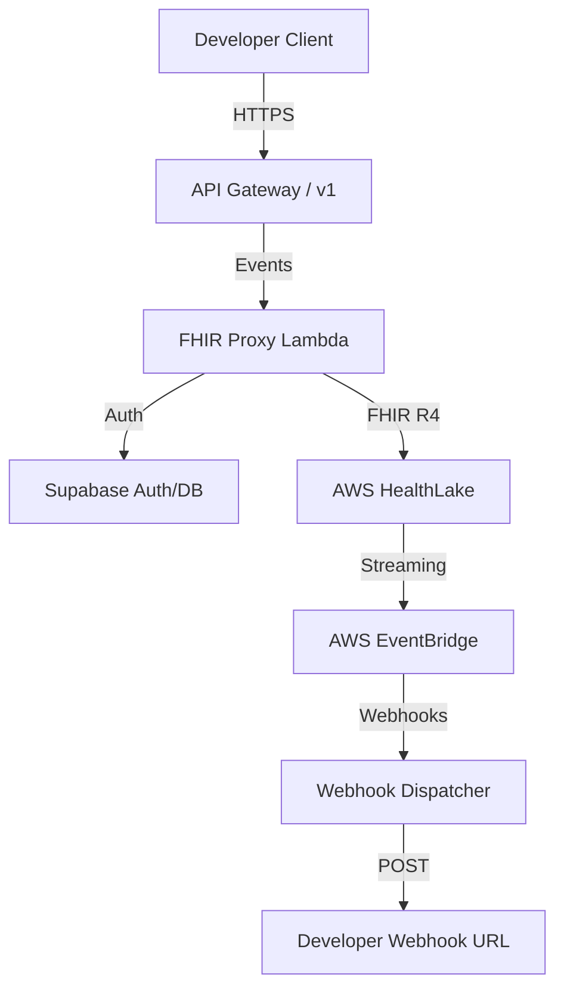

# Implementation: AWS Infrastructure

ClinikAPI leverages AWS Native services for high performance and strict compliance.

## Architecture Diagram

## Key Components

### 1. AWS HealthLake
- **Purpose**: Primary PHI (Protected Health Information) datastore.
- **Config**: Multi-tenant partitioning using tagging or logical datastores per major tenant.
- **Standard**: FHIR R4.

### 2. AWS Lambda (Proxy Engine)
- **Runtime**: Node.js 20+ (ESM).
- **Responsibilities**:
    - Validate API keys via Supabase.
    - Transform simplified requests to FHIR format.
    - Handle referential integrity for FHIR resources (e.g., linking Patient to Observation).

### 3. API Gateway
- **Type**: HTTP API (for lower latency).
- **Security**: Custom Lambda Authorizer for API key verification.

### 4. SST (Serverless Stack)
- **Deployment**: Managed through `sst.config.ts`.
- **Resources**:
    - `Api`: Defining routes.
    - `Function`: Code for transformation/webhooks.
    - `Table`: (Optional) caching of non-PHI metadata.
